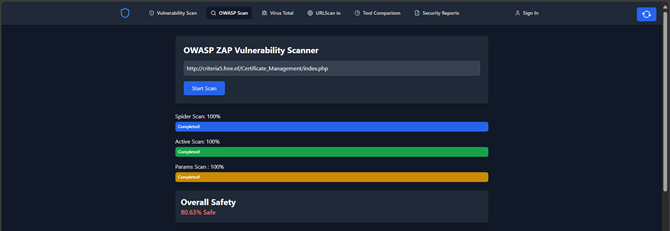
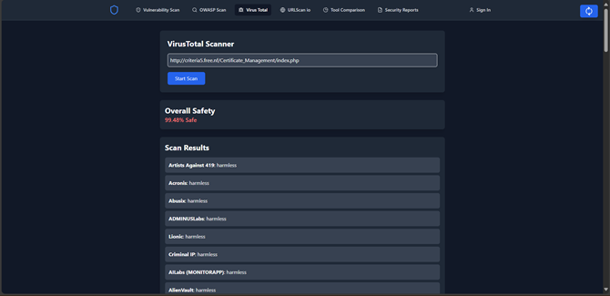

Penetration-Testing-Tools-Using-MERN-STACK

🔐 Web Application Penetration Testing Tool Comparison

This project is a comprehensive full-stack MERN (MongoDB, Express.js, React.js, Node.js) web application designed to evaluate and compare the effectiveness of popular web application penetration testing tools, including  OWASP ZAP, VirusTotal, and URLScan.io. The aim is to analyze how well each tool detects security vulnerabilities in web applications and to assist developers and security professionals in choosing the right tools for their cybersecurity needs.

📌 Key Features

Real-time Vulnerability Scanning: Users can initiate scans and monitor progress in real-time using a React-based frontend and WebSocket integration.

Vulnerable Test Application: A custom-built application with intentional security flaws is used as a test bed to simulate real-world attacks and measure tool effectiveness.

Tool Comparison Dashboard: Visual comparison of tool results using dynamic charts (bar graphs, pie charts) to represent vulnerabilities detected, their severity (Low/Medium/High), and false positives/negatives.

Secure User Authentication: Login and registration system implemented using JWT tokens and bcrypt to ensure secure access to scan history and data.

Historical Data & Report Downloads: Scan results are stored in MongoDB, allowing users to review past scans and download detailed reports in PDF or CSV formats.

CI/CD Integration: Supports automation and integration into CI/CD pipelines, enabling developers to receive instant alerts on vulnerabilities during development or testing stages.

🔍 Tools Evaluated

OWASP ZAP – Open-source penetration testing tool from the OWASP Foundation.

VirusTotal – Aggregates data from multiple antivirus engines and scanners.

URLScan.io – Web service that analyzes and indexes websites to detect potential threats and suspicious behaviors.

⚙️ Evaluation Criteria

Each tool is evaluated across several performance metrics:

Accuracy: Detection rate of real vulnerabilities with minimal false positives/negatives.

Scan Speed: Time taken to complete scans.

Resource Usage: System impact during scanning.

Usability: Ease of use for both beginners and experienced testers.

Automation Capability: Ability to integrate with CI/CD pipelines and generate automated reports.

Cost-Effectiveness: Whether the tool provides good value for the features offered.

🎯 Project Goals

Provide a real-world, practical comparison of leading vulnerability scanners.

Help teams choose the most effective security tool based on detailed performance metrics.

Promote continuous security testing by enabling smooth integration into development workflows.

Offer developers a centralized dashboard to initiate scans, monitor results, and take immediate remediation actions.

🛠️ Project Setup Instructions

Follow the steps below to set up and run the project on your local machine:

1. 📥 Install OWASP ZAP Scanner
Download and install the OWASP ZAP tool on your system.
This tool is essential for performing active scans on your test web application.

2. 🔑 Get Required API Keys
To integrate with external vulnerability scanning tools, generate API keys from the following platforms:

	OWASP ZAP: Launch ZAP, go to Tools > Options > API, and enable the API key. Copy the key.

	URLScan.io: Register and get your API key from the dashboard.

	VirusTotal: Sign up and access your API key from your profile settings.

3. 📦 Install Project Dependencies
Open your terminal and navigate to the root directory. Then install dependencies for both frontend and backend:

		cd backend
		npm install
	
		cd ..
		npm install

4. 📁 Create .env File
In the backend folder, create a .env file and add the following configuration:

		PORT=5002
	
		MONGO_URI=mongodb://localhost:27017/PenetrationDB
	
		ZAP_API_KEY=your_zap_api_key_here
	
		ZAP_BASE_URL=http://127.0.0.1:8080
	
		VIRUSTOTAL_API_KEY=your_virustotal_api_key_here
	
		URLSCAN_API_KEY=your_urlscan_api_key_here
	
		JWT_SECRET=my_secret_pwd

6. 🚀 Run the Backend Server
Start the Express server by navigating to the backend folder and running:

		node server.js

7. 💻 Run the Frontend Application
In a new terminal window, navigate to the frontend folder and start the development server:

	 	npm run dev

Once everything is running, you’ll be able to access the web interface, initiate scans, and view real-time results and comparisons across all the integrated tools.

Sample Screenshots:

